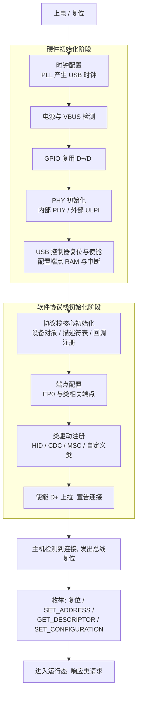
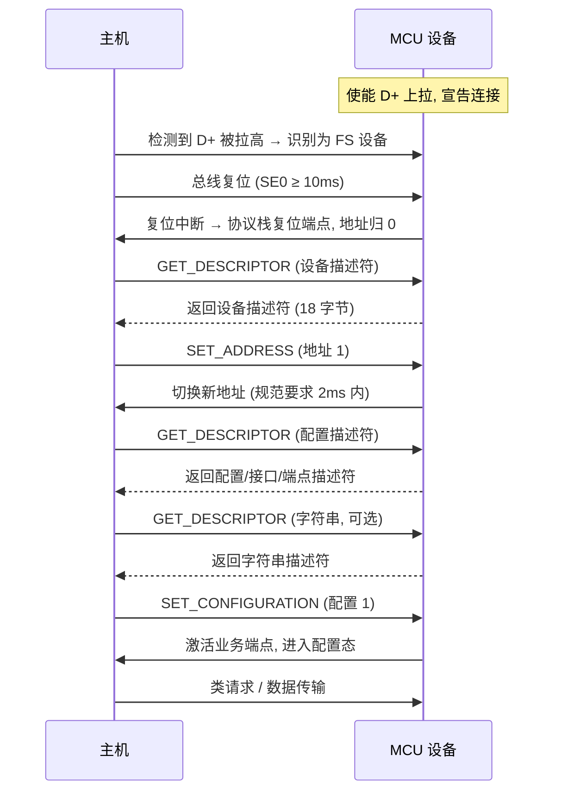
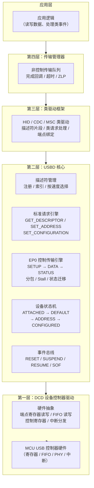
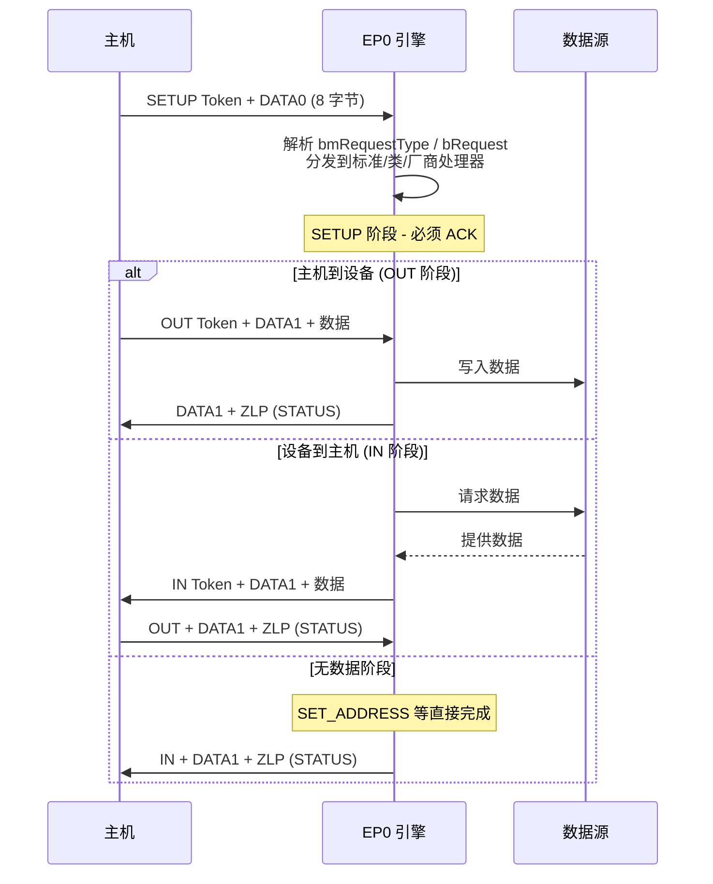
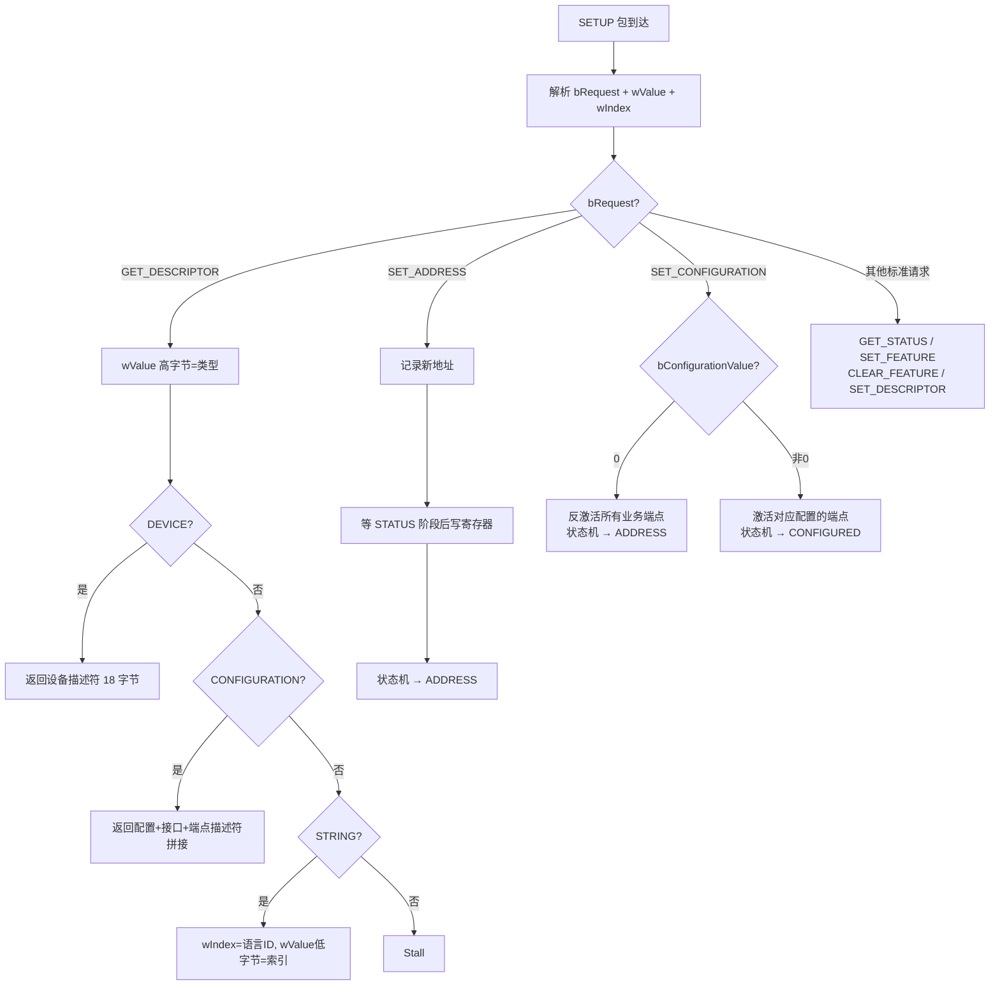
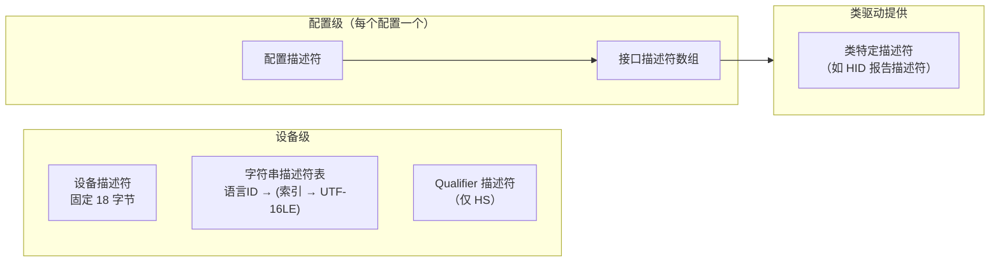

# MCU USB 启动流程说明

> 面向嵌入式开发者的技术说明，覆盖从芯片上电复位到 USB 设备可被主机正确枚举的完整链路，包括硬件初始化阶段与软件协议栈初始化阶段，并重点分析哪些步骤会随 USB 协议（传输速度、设备类别、主机/设备角色）的不同而需要开发者主动干涉。

## 目录

- [1. 总体流程](#1-总体流程)
- [2. 硬件初始化阶段](#2-硬件初始化阶段)
- [3. 软件协议栈初始化阶段](#3-软件协议栈初始化阶段)
- [4. 需要根据 USB 协议干涉的步骤](#4-需要根据-usb-协议干涉的步骤)
- [5. 常见问题与调试建议](#5-常见问题与调试建议)
- [6. 从零实现 USB 设备协议栈](#6-从零实现-usb-设备协议栈)

---

## 1. 总体流程

USB 启动的本质，是把一块"裸"的 MCU 逐步变成主机能够识别、配置并通信的外设。整个过程分为两个边界清晰的阶段：**硬件初始化阶段**让 USB 物理层和控制器进入可工作状态；**软件协议栈初始化阶段**让设备在协议层面具备响应枚举和类请求的能力。两个阶段之间以"使能 D+/D- 上拉电阻（即宣告设备连接）"为分界点，此后总线上的活动完全由 USB 协议时序驱动。



硬件阶段的重点是"把电和时钟供对、把引脚和 PHY 配对"；软件阶段的核心则是"把描述符和端点按协议配对"。开发者在这两个阶段需要做出的关键决策（目标速度、设备类别、供电方式）大多在编译期和初始化代码中固定，之后的枚举行为由协议栈和硬件状态机接管。

## 2. 硬件初始化阶段

硬件初始化发生在任何 USB 数据收发之前，目标是让 USB 外设模块获得正确的时钟、电源、引脚和控制器状态。这一阶段绝大多数代码与具体芯片强相关，但直接绑定一个协议属性：**传输速度**——全速（FS, 12 Mbps）和低速（LS, 1.5 Mbps）对时钟、上拉电阻位置的要求不同，高速（HS, 480 Mbps）还额外引入速度协商（Chirp）和 PHY 选择。

### 2.1 时钟配置

USB 模块需要精确的基准时钟，这是整个硬件阶段最容易出问题的环节。

- **时钟源与频率**：FS 设备通常要求 48 MHz 的 USB 时钟，一般由外部晶振经 PLL 倍频产生；LS 设备时钟要求更宽松，但同一 PLL 链路仍需正确配置。HS 设备若使用内部 PHY，需满足 PHY 对 UTMI/ULPI 接口时钟（通常为 60 MHz）的要求。
- **无晶振方案**：部分低成本 MCU 支持内部 RC 振荡器加出厂校准，此时 USB 时钟精度依赖校准值，环境温漂可能影响位定时，初始化时必须显式应用校准值。
- **时钟使能顺序**：必须先使能 PLL 并等待锁定标志，再使能 USB 外设时钟，否则控制器可能处于未知状态。

### 2.2 电源与 VBUS 检测

- **收发器电源**：使能 USB 收发器供电（部分芯片有独立 USB 电源域或内部 3.3V LDO），并确认参考电压配置正确。
- **VBUS 检测**：若设计依赖 VBUS 检测（如电池供电设备仅在插入时启用 USB），需配置 VBUS 感知引脚和对应中断；总线供电设备还涉及过流保护。
- **低功耗**：若产品需要支持挂起唤醒，需在初始化阶段就配置好唤醒源（VBUS、D+ 电平变化或 RTC），否则后续进入低功耗后无法被主机唤醒。

### 2.3 GPIO 复用与上拉电阻

- 将 D+、D- 引脚复用为 USB 功能。部分 MCU 的 D+ 引脚内置 1.5 kΩ 上拉开关（如 STM32 的 PA12），上拉由软件控制——这正是"软件宣告连接"的机制。
- **上拉位置由速度决定**：FS 设备在 D+ 上拉 1.5 kΩ，LS 设备在 D- 上拉 1.5 kΩ；HS 设备在 Chirp 协商前先表现为 FS，因此也按 FS 配置 D+ 上拉。主机侧两条数据线上各有一个 15 kΩ 下拉，设备侧上拉被主机识别为"设备已连接"。

### 2.4 PHY 初始化

- **内部 PHY**：大多数低端 MCU 集成 FS PHY，无需外部器件，只需完成时钟和收发器供电。
- **外部 PHY（HS 场景）**：高速需要更高质量的收发器，许多 MCU 通过 UTMI/ULPI 接口外接 PHY。初始化时要配置接口时序、时钟方向（PHY 或 MCU 提供时钟）以及 PHY 寄存器（经 I2C/SPI 或 ULPI 管理接口访问）。
- **HS 速度协商**：HS 设备收到总线复位后，需在规范规定的窗口内发起 K Chirp 并响应主机的 K/J Chirp 序列才能切到 480 Mbps。该过程部分由硬件自动完成，但启用 HS 能力、处理降级回 FS 的逻辑属于软件职责。

> **注意：PHY 初始化是"硅片事实"，不是软件策略。** 寄存器地址、位域含义、写时序在芯片流片时固定，任何框架（Zephyr、RT-Thread、厂商 SDK 等）想让这颗 PHY 工作都必须写同一批寄存器、按同一顺序写——没有设计自由度，各框架的写法必然收敛。因此直接照厂商参考手册或 SDK 的 PHY 初始化序列抄即可，不要自行"优化"。

### 2.5 控制器复位、使能与中断

- **外设复位与使能**：将 USB 控制器置于复位状态，配置端点 RAM 或 FIFO 的基地址与大小，然后解除复位并使能。
- **中断使能**：按需使能总线复位（RESET）、挂起/恢复（Suspend/Resume）、SETUP 完成、端点传输完成、SOF、VBUS 等中断。其中**总线复位中断是硬件阶段与软件阶段的"发令枪"**——控制器检测到总线复位（SE0 持续约 2.5 µs）后产生该中断，协议栈随即开始枚举响应。
- **DMA 与缓冲**：若使用 DMA 搬运端点数据，需为各端点配置 DMA 通道和描述符链。

硬件阶段完成后，USB 控制器已经"通电待命"，但设备尚未宣告连接，主机也看不到它。接下来进入软件协议栈初始化阶段。

## 3. 软件协议栈初始化阶段

软件协议栈初始化发生在硬件就绪之后、宣告连接之前。它的任务是把协议栈"装配"成符合目标协议形态的实例：注册描述符、配置端点、挂接类驱动，最终使能上拉电阻把设备送上总线。主流开源方案（STM32 USB Device Library、TinyUSB、Zephyr USB Device Stack 等）的初始化流程在结构上高度一致，差异主要在 API 形态和配置方式。

### 3.1 协议栈核心初始化

- **创建设备对象**：初始化协议栈核心结构体（设备、速度、状态机），通常以注册回调集合的形式完成——包括事件回调（复位、挂起、恢复、SOF）和请求分发回调（标准请求 + 类请求）。
- **注册描述符表**：把设备描述符、配置描述符、字符串描述符等绑定到协议栈。多数协议栈允许按速度（FS/HS）提供不同描述符集，枚举时由栈自动选择。
- **配置缓冲区**：为 EP0 和传输分配内存。EP0 最大包长在 FS/HS 下通常配置为 64 字节。

### 3.2 端点配置

端点配置是协议栈初始化的核心动作，直接决定设备能否承载目标类协议：

- **EP0（控制端点）**：由协议栈自动建立，方向双向，负责枚举和标准请求。开发者通常只需设定最大包长（FS 可设 8/16/32/64，HS 固定 64）。
- **业务端点**：按设备类别创建，每个端点需指定方向（IN/OUT）、传输类型（控制/中断/批量/同步）、最大包长和轮询间隔（bInterval）。这些参数全部来自目标协议的描述符定义，协议栈本身不做任何推断。
- **FIFO/缓冲分配**：在有硬件 FIFO 的控制器上（如 STM32 USB OTG），需为每个端点显式分配 FIFO 地址和深度，ISO 端点通常需要更大 FIFO 和双缓冲支持。

### 3.3 类驱动注册

- 协议栈在初始化阶段把类驱动实例挂接到设备上，每个类驱动提供自己的初始化函数、描述符片段和请求处理回调。
- 类驱动的初始化通常还包含应用层回调（数据收发完成、类请求到达时通知上层），例如 CDC 的收发回调、HID 的报告发送函数。
- 多接口组合设备（如 CDC + MSC 复合设备）需依次注册多个类驱动，并确保接口号、端点号不冲突。

### 3.4 宣告连接与枚举

初始化装配完成后，协议栈执行最后一步：**使能 D+ 上拉电阻（软件控制连接）**。此后硬件自动完成以下枚举流程，软件只需通过中断响应：



- **总线复位**：主机识别到连接后发出至少 10 ms 的 SE0。设备收到复位中断后，必须复位所有端点、将设备地址归零、等待 SET_ADDRESS，并重新装载描述符状态。规范要求设备在复位结束后 10 ms 内能够响应控制传输。
- **SET_ADDRESS**：设备须在完成该请求后 2 ms 内切换到新地址，此后所有包都使用新地址通信。
- **SET_CONFIGURATION**：主机最终选择某个配置（对应配置描述符的 bConfigurationValue），设备据此真正激活业务端点。收到该请求前，业务端点虽然已注册，但不应被主机使用。
- **进入运行态**：枚举完成后，设备进入配置状态，开始响应类特定请求和普通数据传输。

## 4. 需要根据 USB 协议干涉的步骤

USB 启动链路中，哪些步骤需要开发者干涉、干涉到什么程度，由三个协议维度决定：**传输速度（LS/FS/HS）、设备类别（类协议）、设备角色（Device/Host/OTG）**。

### 4.1 维度一：传输速度（LS / FS / HS）

速度决定物理层与枚举前的行为差异，主要影响硬件初始化阶段和描述符中的速度相关字段。

| 启动步骤 | 低速 LS（1.5 Mbps） | 全速 FS（12 Mbps） | 高速 HS（480 Mbps） |
| --- | --- | --- | --- |
| 上拉电阻位置 | D- 上拉 1.5 kΩ | D+ 上拉 1.5 kΩ | 先按 FS 在 D+ 上拉，Chirp 成功后切换 |
| USB 时钟 | 精度要求最宽松 | 通常需精确 48 MHz | 需满足 PHY 接口时钟（如 ULPI 60 MHz） |
| PHY | 集成 FS/LS PHY 即可 | 集成 FS PHY 即可 | 常需外部 PHY（UTMI/ULPI） |
| 速度协商 | 无 | 无 | 复位后 K/J Chirp 序列，失败则降级 FS |
| EP0 最大包长 | 8 字节 | 8/16/32/64（常用 64） | 固定 64 |
| 描述符要求 | bcdUSB 按实际声明 | bcdUSB 按实际声明 | 需提供 Device Qualifier 与 Other Speed Configuration 描述符 |
| 轮询间隔 bInterval | 直接以 ms 为单位 | 直接以 ms 为单位 | 中断端点为 2 的幂次（微帧），语义不同 |

速度维度上必须干涉的是：上拉电阻的接入点与时机、USB 时钟链路、HS 场景下的 PHY 选型与 Chirp/降级处理，以及描述符里 bcdUSB 和速度相关字段。只要声明 bcdUSB 为 2.00 并支持 HS，就必须准备完整的 HS 描述符集。

### 4.2 维度二：设备类别（类协议）

类别决定端点拓扑、描述符结构和类请求处理，主要影响软件协议栈初始化阶段。

| 启动要素 | HID（键盘/鼠标） | CDC（虚拟串口） | MSC（U 盘） | UVC/音频 |
| --- | --- | --- | --- | --- |
| 业务端点类型 | 中断 IN（+可选中断 OUT） | 批量 IN/OUT + 中断 IN（通知） | 批量 IN/OUT | 同步（ISO）IN/OUT |
| 典型端点组合 | 1 个中断端点，包长通常 8/16/64 | 2-3 个端点 | 2 个批量端点，包长 64/512 | 2-4 个 ISO 端点 + 中断端点 |
| 初始化时需干涉 | 报告描述符、bInterval | 线路编码/控制线状态处理、串口参数回调 | CBW/CSW 块协议状态机、介质读写接口 | 接口交替设置、带宽预留、帧率/格式描述符 |
| 类请求 | GET/SET_REPORT、GET/SET_IDLE、GET/SET_PROTOCOL | SET_LINE_CODING、SET_CONTROL_LINE_STATE 等 | 标准 BOT 请求 + Reset Recovery | GET_CUR/SET_CUR 等音视频控制请求 |
| 主要风险点 | 报告描述符与主机驱动不匹配 | 枚举后波特率/流控参数需动态调整 | 端点包长与块大小不匹配 | ISO 带宽不足或 FIFO 太浅导致丢帧 |

类别维度上的干涉几乎全部发生在软件阶段：描述符里的接口类代码（bInterfaceClass）、端点类型和数量、类驱动回调、类请求解析。协议栈的通用枚举框架不感知这些差异，全部由开发者按目标协议规范填写。

### 4.3 维度三：设备角色（Device / Host / OTG）

前文默认设备模式。若角色变为主机或 OTG，初始化内容会有额外差异：

- **Host 模式**：需额外配置根端口电源控制和过流检测、端口速度检测（检测 D+/D- 上拉判断接入设备速度）、总线复位时序（复位至少 10 ms、上电后等待设备稳定约 100 ms），并加载 Hub 驱动与传输调度器。设备侧描述符等"被枚举方"配置不再需要，改为实现主机侧请求发起逻辑。
- **OTG 模式**：需处理会话请求协议（SRP）和主机协商协议（HNP），初始化时使能 OTG 控制器、VBUS 会话感知和 ID 引脚检测，角色切换时可能要重新执行部分硬件初始化。

角色维度决定初始化方向是"把自己装成设备"还是"去枚举别人"，两条路径在硬件初始化步骤上大部分重叠（时钟、PHY、控制器），在软件初始化步骤上几乎完全分叉。

### 4.4 逐步骤干涉清单

把各启动步骤按干涉程度标注。分三档：**必须干涉**（协议决定，不写就错）、**视需求干涉**（取决于产品功能取舍）、**无需干涉**（协议栈或硬件封装，一般不碰）。

| 启动步骤 | 干涉程度 | 干涉内容与协议依据 |
| --- | --- | --- |
| 硬件：时钟配置 | 必须干涉 | 频率由目标速度决定（FS 48 MHz、HS 需 PHY 时钟）；无晶振方案需应用校准值 |
| 硬件：电源与 VBUS | 视需求干涉 | 总线供电/自供电影响配置描述符 bMaxPower 与供电属性；电池设备需 VBUS 检测逻辑 |
| 硬件：GPIO 与上拉 | 必须干涉 | 上拉位置按速度选择（LS 在 D-，FS/HS 在 D+）；软件连接时机决定何时宣告连接 |
| 硬件：PHY | 必须干涉 | FS 用内部 PHY；HS 需外部 PHY 及其寄存器初始化、时钟方向配置 |
| 硬件：HS 速度协商 | 视需求干涉 | 仅 HS 需要；需启用 Chirp 响应并处理降级回 FS 的路径 |
| 硬件：控制器复位/中断 | 无需干涉 | 厂商库封装；端点 RAM/FIFO 大小需按端点数量和类型调整 |
| 软件：EP0 配置 | 视需求干涉 | 最大包长按速度取值；不符会导致枚举阶段传输异常 |
| 软件：设备描述符 | 必须干涉 | bcdUSB、bDeviceClass、VID/PID、iManufacturer/iProduct 全部按产品协议定义 |
| 软件：配置/接口/端点描述符 | 必须干涉 | 接口类代码、端点类型/方向/包长/bInterval 完全由类协议决定 |
| 软件：字符串描述符 | 视需求干涉 | 语言 ID 与厂商/产品字符串按产品定义；不影响枚举成败但影响识别 |
| 软件：类驱动注册 | 必须干涉 | 挂接哪个类驱动、注册哪些回调由设备类别决定 |
| 软件：宣告连接时机 | 视需求干涉 | 可在枚举前延迟上拉（如等待外设就绪或 VBUS 有效） |
| 软件：类请求处理 | 必须干涉 | HID 报告、CDC 线路编码、MSC CBW/CSW 等必须按类协议实现 |
| 软件：挂起/远程唤醒 | 视需求干涉 | 需在描述符 bmAttributes 声明远程唤醒能力，并实现唤醒触发逻辑 |

### 4.5 干涉判断原则

一条通用判断原则：**协议栈负责"设备如何说话"，开发者负责"设备说什么"**。

- 协议无关层——时钟使能顺序、控制器复位、EP0 传输状态机、标准请求收发骨架、枚举状态迁移——由厂商库或开源协议栈封装，开发者通常不需要改动。
- 协议相关层——描述符内容、端点拓扑、类驱动选择、类请求语义、速度协商、供电与唤醒策略——与"这个设备到底是什么"强绑定，必须按目标协议逐一配置。
- 判断一个步骤是否需要干涉，只需问：**这个步骤的参数是否随协议变化？** 固定不变的是库的职责，随协议变化的就是开发者的职责。

## 5. 常见问题与调试建议

启动阶段的故障几乎都集中在枚举之前或枚举过程中。按故障现象从外到内排查，可快速缩小范围。

### 5.1 故障现象与定位

| 故障现象 | 最可能原因 | 检查方向 |
| --- | --- | --- |
| 主机完全无反应（无"设备接入"提示） | 上拉未使能或上拉位置错误 | 用示波器确认 D+（FS）或 D-（LS）是否被拉高；确认软件连接步骤已执行 |
| 枚举中断在设备描述符 | USB 时钟不准（位定时错误） | 测量 48 MHz 时钟精度；无晶振方案重新应用校准值 |
| "设备描述符请求失败"或超时 | EP0 最大包长与描述符声明不一致；响应超出规范时间窗 | 核对 bMaxPacketSize0 与实际配置；确认复位后 10 ms 内能响应 |
| 枚举到配置描述符后失败 | 描述符结构不合法（长度、接口/端点数量不匹配） | 用 USB 分析工具解析描述符树，与规范逐字段核对 |
| SET_CONFIGURATION 后无响应 | 业务端点未正确激活或 FIFO 未分配 | 检查 SET_CONFIGURATION 回调中端点使能逻辑与 FIFO 深度 |
| HS 设备只在 FS 下工作 | Chirp 协商失败，或缺少 Device Qualifier 描述符 | 检查 PHY 配置与 Chirp 响应代码；补齐 HS 描述符集 |
| 特定主机正常、另一些异常 | 时序或电气裕量不足（suspend/恢复、复位时序） | 对照规范检查复位后响应窗口、挂起唤醒时序 |

### 5.2 推荐的调试手段

- **USB 协议分析仪或抓包工具（Wireshark + USBPcap、Bus Hound）**：启动问题几乎都要靠抓包确认主机发到哪一步、设备有没有应答、应答内容是什么。这是定位枚举问题最直接的证据。
- **逻辑分析仪/示波器**：确认电气层——上拉是否生效、Chirp 是否出现、复位长度是否达标、时钟抖动是否在容差内。
- **协议栈日志**：在复位、SETUP、SET_ADDRESS、SET_CONFIGURATION 等关键事件处打印日志，与抓包结果互相印证。
- **串口打印兜底**：当 USB 本身不通时，用 UART 输出调试信息，确认代码执行到了哪一步。

### 5.3 调试时的两条时间窗提醒

- 设备被复位后，必须在规范规定的时间窗内（复位结束后 10 ms 内）响应控制传输，任何阻塞式初始化（例如在 USB 中断里做慢速 I/O）都可能直接导致枚举超时。
- 设备上电后 100 ms 内必须能接受复位。若应用初始化耗时过长（例如外部 Flash 校验、文件系统挂载），应推迟使能上拉，让设备"晚一点上线"，而不是让主机在等待中报错。

---

## 6. 从零实现 USB 设备协议栈

> 硬件初始化（时钟、PHY、GPIO、控制器复位）由硅片决定，所有框架写法相同。真正的差异发生在软件层——本段从零开始，完整拆解一个 USB 设备协议栈需要实现的所有模块，按"分层模型 → 各层模块 → 最小实现路径"的顺序展开。

### 6.1 总体架构：四层模型

从零实现时，建议将协议栈划分为四个层次。自下而上分别是：**设备控制器驱动（DCD）→ USB 设备核心（USBD Core）→ 类驱动框架（Class Framework）→ 传输管理器（Transfer Manager）**。层次之间通过明确的接口调用，每层只依赖下一层。



各层职责一句话概括：

| 层次 | 职责 | "它对下承诺什么" |
|------|------|------------------|
| DCD | 将抽象的 USB 操作翻译为具体芯片的寄存器操作 | "给我端点号和缓冲区，我帮你收发" |
| USBD Core | 实现 Chapter 9 标准请求、枚举状态机、EP0 传输 | "给我描述符，我帮你完成枚举" |
| Class Framework | 管理类驱动注册、非标准请求路由、端点绑定 | "给我类驱动实例，我帮你挂到设备上" |
| Transfer Manager | 管理非控制传输队列、完成通知、超时处理 | "给我传输请求，我异步通知你结果" |

### 6.2 第一层：设备控制器驱动（DCD）

DCD 是整个协议栈唯一直接操作硬件寄存器的层。它是"硅片事实"和"软件策略"的分界线——寄存器写什么由芯片决定，但谁在什么时候调这些写操作，由协议栈设计决定。

#### 6.2.1 DCD 最小接口定义

以下接口与具体芯片无关，是抽象层应当提供的最小集合。

**控制类操作**：

| 接口 | 作用 | 关键细节 |
|------|------|----------|
| `dcd_init(speed)` | 初始化控制器，配置速度模式 | 必须在 ep0 配置前调用；速度决定后续 ep0 的最大包长 |
| `dcd_connect()` / `dcd_disconnect()` | 使能 / 关闭 D+ 上拉 | 即"宣告连接"与"断开连接"的软件开关 |
| `dcd_set_address(addr)` | 设置设备地址（0-127） | 规范要求 SET_ADDRESS 请求后 2ms 内生效；实现上可在 Status 阶段结束后才写到寄存器 |
| `dcd_remote_wakeup()` | 发起远程唤醒 | 将 D+ 拉低再释放（或 D- 对 LS），时序精确到 ms |

**端点操作**：

| 接口 | 作用 | 关键细节 |
|------|------|----------|
| `dcd_ep_open(ep_addr, type, max_packet_size)` | 打开端点，配置类型和最大包长 | 返回端点句柄；硬件 FIFO 需在此分配 |
| `dcd_ep_close(ep_addr)` | 关闭端点，释放资源 | 释放 FIFO 分配 |
| `dcd_ep_stall(ep_addr)` / `dcd_ep_clear_stall(ep_addr)` | 设置 / 清除端点的 Stall 状态 | EP0 的 Stall 只在 DATA/STATUS 阶段；业务端点在收到 Clear Feature 后清除 |
| `dcd_ep_write(ep_addr, buf, len)` | 向端点 FIFO 写数据（IN 传输） | 数据不超过最大包长时才可调用；返回实际写入字节数 |
| `dcd_ep_read(ep_addr, buf, len)` | 从端点 FIFO 读数据（OUT 传输） | 调用前需确认 OUT 完成中断已触发 |
| `dcd_ep_xfer(ep_addr, buf, len)` | 启动端点传输（DMA 模式） | 适用于使用 DMA 的控制器；传输完成后通过回调通知 |

**中断分发入口**：

| 中断源 | 上层回调 | 协议栈处理动作 |
|--------|----------|----------------|
| 总线复位（RESET） | `event_cb(RESET)` | 状态机 → DEFAULT；清地址；复位端点 |
| 挂起（SUSPEND） | `event_cb(SUSPEND)` | 3ms 无总线活动触发；进入低功耗逻辑 |
| 恢复（RESUME） | `event_cb(RESUME)` | 退出低功耗；恢复时钟 |
| SOF | `event_cb(SOF)` | 帧计数；ISO 传输调度 |
| SETUP 包完成 | `setup_recv_cb(setup_pkt)` | EP0 引擎解析并分发 |
| 端点 IN 完成 | `ep_xfer_complete(ep, len)` | 传输管理器通知上层 |
| 端点 OUT 完成 | `ep_xfer_complete(ep, len)` | 传输管理器通知上层 |

#### 6.2.2 DCD 实现的关键约束

- **端点 0 必须最先配置**：控制器使能后立即打开 EP0，最大包长由速度决定。EP0 是所有枚举通信的通道，没有 EP0 主机无法下发任何请求。
- **中断必须尽快分发**：DCD 的 ISR 只做三件事——读状态寄存器、清除中断标志、调上层回调。任何阻塞操作（打印日志、长时间数据处理）必须在回调中通过标志位触发、在 main 循环中执行，绝不能在 ISR 里做。
- **FIFO 分配是全局资源**：对 STM32 USB OTG 这种共享 FIFO 的控制器，`dcd_ep_open` 时需要计算偏移和深度，分配策略影响端点数上限。建议初始化时先做全局 FIFO 规划（EP0 + 各业务端点的深度列表），再逐个分配。

### 6.3 第二层：USB 设备核心（USBD Core）

USBD Core 是协议栈的心脏，不依赖任何特定芯片——所有对硬件的操作都通过 DCD 接口间接完成。从零实现时需实现以下四个子模块。

#### 6.3.1 设备状态机

USB 2.0 Spec Chapter 9.1 定义了设备必须维护的状态机，建议严格按规范建模：

```mermaid
stateDiagram-v2
    [*] --> ATTACHED : 上电, Host 未供电
    ATTACHED --> POWERED : VBUS 有效
    POWERED --> DEFAULT : 总线复位 (RESET)
    DEFAULT --> ADDRESS : SET_ADDRESS
    ADDRESS --> CONFIGURED : SET_CONFIGURATION (非 0)
    CONFIGURED --> ADDRESS : SET_CONFIGURATION (0)
    ADDRESS --> DEFAULT : 总线复位
    CONFIGURED --> DEFAULT : 总线复位
    DEFAULT --> POWERED : VBUS 移除 → 挂起超时
    ADDRESS --> POWERED : VBUS 移除 → 挂起超时
    CONFIGURED --> POWERED : VBUS 移除 → 挂起超时
    POWERED --> ATTACHED : VBUS 移除
```

状态机切换规则：

| 状态 | 允许响应的请求 | 状态含义 |
|------|---------------|----------|
| ATTACHED | 无 | 设备已物理连接，但 VBUS 未供电 |
| POWERED | 无（只等复位） | VBUS 已供电，等待总线复位 |
| DEFAULT | GET_DESCRIPTOR, SET_ADDRESS | 已完成复位，设备地址为 0 |
| ADDRESS | GET_DESCRIPTOR, SET_CONFIGURATION, SET_DESCRIPTOR（可选） | 已有唯一地址，但业务端点未激活 |
| CONFIGURED | 全部标准请求 + 类请求 + 业务传输 | 完全就绪，可以正常通信 |

实现要点：
- 用枚举（`enum usb_device_state`）表示状态，所有状态切换集中在一个函数 `usbd_set_state()` 中。
- 每次状态切换做入口校验——例如从 DEFAULT 直接跳到 CONFIGURED 是非法的（必须经过 ADDRESS）。
- 状态切换时触发对应的进入/退出钩子（如进入 CONFIGURED 时激活业务端点）。

#### 6.3.2 EP0 控制传输引擎

这是协议栈中最核心、最复杂的单个模块。EP0 上的每一次控制传输都遵循严格的三阶段流程：



SETUP 包 8 字节结构必须解析：

```c
typedef struct {
    uint8_t  bmRequestType;  // D7:方向 D6-5:类型 D4-0:接收者
    uint8_t  bRequest;       // 具体请求码
    uint16_t wValue;         // 请求参数（Little-Endian）
    uint16_t wIndex;         // 接口/端点索引（Little-Endian）
    uint16_t wLength;        // DATA 阶段期望长度（Little-Endian）
} usb_setup_packet_t;
```

`bmRequestType` 的三个字段决定了"谁处理这个请求"：

| 字段 | 取值 | 含义 | 分发目标 |
|------|------|------|----------|
| D6-D5: 类型 | 00 | 标准请求 | USBD Core 自己处理 |
| D6-D5: 类型 | 01 | 类请求 | 路由到对应类驱动 |
| D6-D5: 类型 | 10 | 厂商请求 | 路由到应用层回调 |
| D4-D0: 接收者 | 0 | 设备 | 全局操作 |
| D4-D0: 接收者 | 1 | 接口 | 路由到对应接口的类驱动 |
| D4-D0: 接收者 | 2 | 端点 | 路由到对应端点的处理 |

EP0 引擎的 Stall 策略：
- SETUP 阶段绝不可以 Stall（规范强制要求）。
- DATA 阶段：收到不支持的请求（或无数据处理）→ Stall。
- STATUS 阶段：数据方向与实际传输不匹配 → Stall。
- 发生 Stall 后，EP0 自动准备好接收下一个 SETUP（硬件级自动恢复）。

#### 6.3.3 标准请求处理器（Chapter 9 Request Handler）

GET_DESCRIPTOR 是最复杂的标准请求——需要按描述符类型、索引、语言 ID 做三级路由：



关键实现细节：

**GET_DESCRIPTOR 的分包返回**：主机请求的 `wLength` 可能小于实际描述符长度，必须返回 `min(wLength, descriptor_total_length)` 个字节，不支持超过 `wLength`。

**配置描述符的特殊性**：GET_DESCRIPTOR(CONFIGURATION) 返回的不是单一描述符，而是**配置描述符 + 接口描述符 + 端点描述符 + 可能的类特定描述符**的拼接块。`wTotalLength`（配置描述符中）必须等于这个拼接块的总长度。这是很多自研协议栈最容易写错的地方。

**SET_ADDRESS 的写入时机**：规范允许设备在 STATUS 阶段完成后才将新地址写到硬件寄存器。实现上通常这样做——在 SETUP 阶段解析并暂存地址，STATUS 阶段的 ACK 发送完成后通过回调写 `dcd_set_address()`，同时切换状态机。

#### 6.3.4 描述符管理模块

描述符模块为上层提供统一的注册/查询接口，隐藏不同协议栈存储方式的差异。描述符不直接存裸字节数组，而是用结构体和长度配对管理，并区分"设备级别的描述符"和"类驱动的描述符片段"——配置描述符由两者拼接而成。



**描述符拼接逻辑**（GET_DESCRIPTOR Configuration 返回的组装过程）：
1. 根据 `wValue` 低字节指定的配置索引找到对应的配置描述符。
2. 依次遍历该配置下的所有接口 → 每个接口下所有备用设置 → 每个备用设置下的所有端点。
3. 每个接口/端点可能附加类特定描述符（由对应的类驱动回调提供）。
4. 组装过程中累加总长度，与配置描述符的 `wTotalLength` 比对。
5. 返回组装后的完整字节流。

**速度感知**：如果设备同时支持 FS 和 HS，需在注册时为两个速度各提供一套配置描述符，USBD Core 根据当前连接速度自动选择对应描述符集。

#### 6.3.5 事件总线

事件总线是 USBD Core 对上（类驱动、应用层）的异步通知机制，从零实现只需一个简单的注册-分发模式：

| 事件 | 触发时机 | 类驱动/应用层的典型处理 |
|------|----------|------------------------|
| RESET | DCD 上报总线复位 | 类驱动：复位内部状态机；应用层：清用户缓冲区 |
| SUSPEND | 3ms 无总线活动 | 类驱动：停止 ISO 传输；应用层：进入低功耗 |
| RESUME | 挂起后检测到总线活动 | 类驱动：恢复 ISO 传输；应用层：恢复时钟和正常工作 |
| SOF | 每 1ms(FS) / 125µs(HS) | 类驱动：触发 ISO 传输调度和帧计数 |
| SETUP_RECV | EP0 收到 SETUP 包 | 见 §6.3.2-6.3.3 |

实现方式：维护一个回调指针数组（按事件类型索引），各模块在初始化时注册自己的处理函数，事件发生时 USBD Core 遍历调用。

### 6.4 第三层：类驱动框架（Class Framework）

类驱动框架的本质是"标准请求之外的请求路由系统"——USBD Core 处理完标准请求后，把类请求和厂商请求分发给对应模块。

#### 6.4.1 类驱动接口定义

每个类驱动必须实现以下结构：

| 回调 | 何时被调 | 职责 |
|------|----------|------|
| `init()` | 设备初始化阶段（宣告连接前） | 注册端点、初始化内部状态 |
| `deinit()` | 设备反初始化或配置切换 | 释放端点、清理资源 |
| `reset()` | 收到总线复位事件 | 复位本类的状态机 |
| `setup_req(setup)` | EP0 收到发往本类接口/端点的非标准 SETUP 请求 | 解析 `bRequest`，处理类请求，返回数据或 Stall |
| `get_config_desc(config_idx, speed)` | USBD Core 构建配置描述符时 | 返回本类提供的描述符片段（接口、端点、类特定描述符） |
| `xfer_complete(ep, len)` | 端点传输完成 | 通知上层数据收发完成 |

#### 6.4.2 请求路由规则

当一个 SETUP 包到达时，分发路径如下：

```
SETUP → 解析 bmRequestType
  ├─ D6-D5=00（标准请求） → USBD Core 标准请求处理器
  ├─ D6-D5=01（类请求）
  │    ├─ D4-D0=1（接口） → 查 wIndex 对应的接口属于哪个类驱动 → 调其 setup_req()
  │    ├─ D4-D0=2（端点） → 查端点属于哪个类驱动 → 调其 setup_req()
  │    └─ D4-D0=0（设备） → 未知设备级类请求 → Stall
  └─ D6-D5=10（厂商请求） → 应用层注册的厂商请求处理器
```

#### 6.4.3 复合设备支持

多接口复合设备（如 CDC+HID）需要多个类驱动共存。框架需要维护：

- **接口到驱动的绑定表**：`(接口号, 备用设置号) → 类驱动实例指针`。
- **端点归属表**：`端点地址 → 类驱动实例指针`（用于 `xfer_complete` 回调和请求路由）。

接口号在注册时由框架自动分配，类驱动不需要自己决定接口号——但需要知道自己的接口号（作为 `wIndex` 的判断依据）。

### 6.5 第四层：传输管理器（Transfer Manager）

EP0 的控制传输由 USBD Core 自己处理，但业务端点（Bulk、Interrupt、ISO）的传输需要上层调度。传输管理器负责将上层发起的传输请求排队、调度到 DCD 层执行、并在完成时通知。

#### 6.5.1 传输请求结构

```c
typedef struct {
    uint8_t  ep_addr;       // 端点地址
    uint8_t *buffer;        // 数据缓冲区指针
    uint16_t total_len;     // 总长度
    uint16_t transferred;   // 已传输字节数
    void    *user_data;     // 用户上下文指针
    void   (*complete_cb)(int status, void *user_data);  // 完成回调
} usb_transfer_t;
```

#### 6.5.2 传输队列

每个端点维护一个传输队列（先入先出），DCD 端点 IN/OUT 完成中断触发时：
1. 从队列头取下一个待传输请求。
2. 调用 `dcd_ep_write` / `dcd_ep_read` 启动传输。
3. 若队列为空，调用上层注册的完成回调。

**ZLP（零长包）处理**：当传输总长恰好是最大包长的整数倍时，USB 协议要求额外发一个 ZLP 才能结束传输。传输管理器需自动处理这个逻辑——在最后一个满包传输完成后，自动追加一个 0 长度传输。

### 6.6 最小实现路径（MVP）

从零实现时不需要一口气写完所有四层，推荐分三阶段逐步构建：

**阶段 A：最小枚举（Day 1-3）**

只需要 DCD + USBD Core 的一部分：
- DCD：`init` / `connect` / `ep_open` (EP0) / `ep_write` / `set_address` / 中断分发（RESET + SETUP + IN 完成）。
- USBD Core：设备状态机 + EP0 控制传输引擎 + GET_DESCRIPTOR(Device) + SET_ADDRESS。

验证标准：用抓包工具确认设备能完成 GET_DESCRIPTOR(Device) 和 SET_ADDRESS，即枚举到获取 18 字节设备描述符并分配地址。

**阶段 B：完整枚举（Day 4-7）**

补全 USBD Core：
- 完整的描述符管理（Device + Config + Interface + Endpoint + String）。
- GET_DESCRIPTOR(Config)、GET_DESCRIPTOR(String)、SET_CONFIGURATION。
- 配置描述符拼接逻辑、GET_STATUS / SET_FEATURE / CLEAR_FEATURE。

验证标准：设备能在设备管理器中正确显示名称、VID/PID；SET_CONFIGURATION 后端点被激活。

**阶段 C：类驱动与传输（Day 8-14）**

加入 Class Framework + Transfer Manager：
- 类驱动注册接口、请求路由（类请求 → 类驱动）、非控制传输队列。
- 至少实现一个 HID 或 CDC 类驱动。

验证标准：设备能正常收发业务数据（HID 发送报告、CDC 收发串口数据）。

### 6.7 关键数据结构一览

| 结构体 | 所属层 | 核心字段 |
|--------|--------|----------|
| `usb_dcd_t` | DCD | 控制/端点操作函数指针表 |
| `usb_device_t` | USBD Core | 状态机当前状态、设备地址、速度、描述符指针、类驱动链表 |
| `usb_setup_packet_t` | USBD Core | bmRequestType, bRequest, wValue, wIndex, wLength |
| `usb_ep_cfg_t` | USBD Core | 端点地址、类型、最大包长、bInterval |
| `usb_desc_device_t` | USBD Core | bcdUSB, bDeviceClass, bMaxPacketSize0, idVendor, idProduct |
| `usb_desc_configuration_t` | USBD Core | wTotalLength, bNumInterfaces, bConfigurationValue, bmAttributes, bMaxPower |
| `usb_desc_interface_t` | Class | bInterfaceNumber, bAlternateSetting, bNumEndpoints, bInterfaceClass/SubClass/Protocol |
| `usb_desc_endpoint_t` | Class | bEndpointAddress, bmAttributes, wMaxPacketSize, bInterval |
| `usb_class_driver_t` | Class | init/deinit/reset/setup_req/get_config_desc/xfer_complete 函数指针 |
| `usb_transfer_t` | Transfer | ep_addr, buffer, total_len, transferred, complete_cb |

### 6.8 与现有框架的对齐验证

从零实现的协议栈应当能与主流框架的行为对齐。验证清单：

| 行为 | 验证方法 |
|------|----------|
| EP0 设置/清除 Stall | 在主机侧用 `libusb_control_transfer` 发不支持的请求，确认设备 Stalled 后仍能正常响应下一个合法请求 |
| GET_DESCRIPTOR 分包 | 发 wLength=8 的 GET_DESCRIPTOR(DEVICE)，确认只返回 8 字节而不是 18 字节 |
| SET_CONFIGURATION(0) | 确认状态机回退到 ADDRESS，业务端点被关闭 |
| 状态机非法跳转 | 在 ADDRESS 状态下发 SET_CONFIGURATION(非 0)，跳过 SET_ADDRESS 看能否被正确拒绝 |
| ZLP 处理 | 传输总长恰好等于最大包长的整数倍，确认自动追加 ZLP |

---

## 附：术语速查

| 术语 | 含义 |
| --- | --- |
| EP0 | 双向控制端点，枚举阶段唯一的通信通道 |
| SE0 | D+ 与 D- 同时拉低的总线状态，主机借此发送复位信号 |
| Chirp | HS 设备与主机之间用于协商 480 Mbps 的 K/J 信号序列 |
| bInterval | 端点描述符中的轮询间隔字段，语义随速度不同 |
| Device Qualifier | HS 设备必须提供的描述符，描述设备在另一种速度下的能力 |
| BOT | Bulk-Only Transport，MSC 类使用的块传输协议（CBW/CSW） |
| SRP / HNP | OTG 的会话请求协议与主机协商协议 |

---

*文档中涉及的时序数值以 USB 2.0 规范（USB 2.0 Specification）为准；具体寄存器和驱动接口以所用 MCU 厂商手册为准。*
