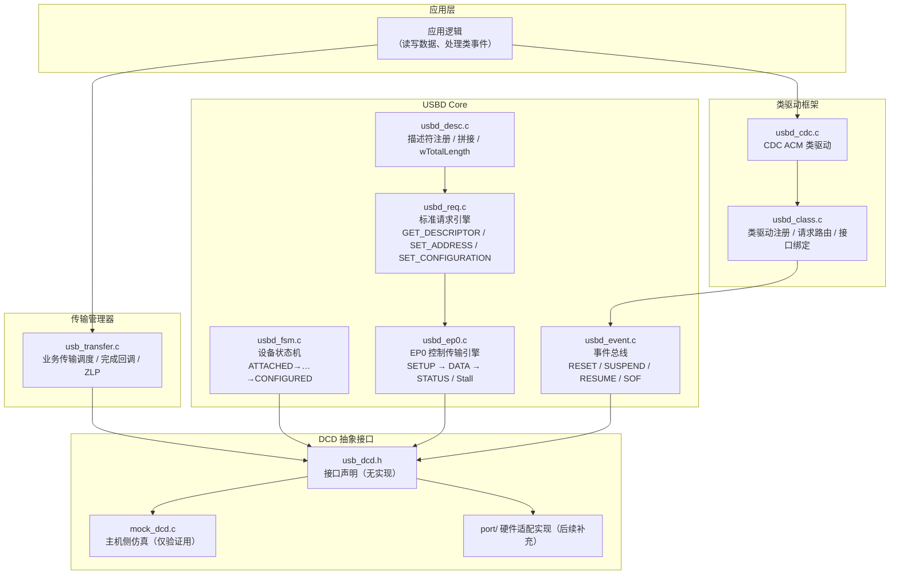

# USB 新手从零搭建框架实践计划（含工程实施 · 每步讲"为什么" · 目标：移植 MCU 后跑通 CDC）

> 本计划是 **新手学习 + 工程实施** 合一的唯一计划文档（合并自原《自研USB框架实现计划.md》与《USB学习计划.md》，后者均已移除）。
>
> 两条主线：
> - **面向新手**：从完全不懂 USB 开始，按顺序亲手填充 `framework/` 骨架，**每一步先讲清"为什么这样做"，再动手填代码、再验证**。
> - **工程落地**：以"移植到一块真实 MCU 并跑通 CDC"为最终验收；模块编号 M1–M10 与骨架文件一一对应。
>
> 架构主线参考《[MCU-USB 启动流程说明](./MCU-USB启动流程说明.md)》。

---

## 目录

- [0. 计划总览](#0-计划总览)
- [1. 写代码之前：先搞懂 USB 是什么](#1-写代码之前先搞懂-usb-是什么)
- [2. 为什么框架要这样搭](#2-为什么框架要这样搭)
- [3. 按顺序填充框架（M1–M10）](#3-按顺序填充框架m1m10)
- [4. 里程碑自测与验证工具](#4-里程碑自测与验证工具)
- [5. 移植到一块真实 MCU 并跑通 CDC](#5-移植到一块真实-mcu-并跑通-cdc)
- [6. 风险与注意事项](#6-风险与注意事项)
- [7. 参考与术语](#7-参考与术语)

---

## 0. 计划总览

### 0.1 目标

从 0 搭建一套**不依赖任何 MCU 的 USB 设备框架**（DCD 只定义抽象接口，USBD Core / 类驱动 / 传输管理器全部与芯片无关），
并在移植到一块真实 MCU 后让 CDC 虚拟串口成功运行。全程用 Mock 无硬件验证协议逻辑，移植时只写 `port/` 适配层。

### 0.2 范围

| 项 | 本阶段 | 后续补充 |
| --- | --- | --- |
| 协议基础 / USBD Core / 类驱动框架 / CDC ACM / 传输管理器 / DCD 抽象接口 | 实现（含 Mock 验证） | — |
| DCD 具体芯片实现（时钟/PHY/GPIO/中断） | **不做** | 硬件适配方案（见 §2.4、§5） |
| 应用层集成（FreeRTOS、具体固件工程） | 仅预留接口 | 硬件适配方案 |
| HS / Host / OTG / ISO / 挂起唤醒 | 不做（后续扩展） | — |

### 0.3 设计原则

1. **DCD 是唯一与硬件对话的层**：USBD Core 及以上代码不得出现寄存器操作，只通过接口 + 事件回调与硬件交互。
2. **协议栈负责"设备如何说话"，开发者负责"设备说什么"**：枚举、EP0、标准请求等通用逻辑归框架；
   描述符内容、类请求语义归类驱动/应用。
3. **无硬件可编译**：框架仅依赖 `stdint.h`/`string.h` 等标准头；**禁止动态内存**，缓冲区由调用方提供。

### 0.4 使用方法

每步按固定循环进行，**顺序不能跳**：

```
1. 读【为什么】—— 理解这一步存在的理由
2. 动手【填充】—— 在对应骨架文件里写代码
3. 跑【验证】 —— 用 Mock / 单测确认行为正确
4. 完成【自检】—— 能回答该步的自检问题，再进入下一步
```

完成标志：第 5 章移植到 MCU 后，Windows 出现 COM 口，PuTTY 能双向收发数据。

---

## 1. 写代码之前：先搞懂 USB 是什么

> 新手最大的误区：直接开始写代码。USB 是一个"主机发问、设备应答"的协议，不理解对话规则，
> 写出来的代码不知道在回答什么问题。先建立 5 个心智模型。

### 1.1 枚举：设备为什么必须"自我介绍"（为什么有枚举）

- **现象**：USB 设备插上后，主机（PC）对设备一无所知——不知道它是什么、能不能用、怎么用。
- **为什么这样设计**：USB 是"即插即用"，设备插入前主机不可能预知它。规范规定：设备插入后，
  主机通过一组固定的"标准问题"来认识设备，这个过程叫**枚举**。
- **把枚举当面试**：
  - 设备描述符 = 简历（你是谁）；
  - SET_ADDRESS = 发工牌（给你一个唯一地址，后面都用它交流）；
  - 配置描述符 = 岗位描述（你提供哪些功能）；
  - SET_CONFIGURATION = 入职（激活功能，开始干活）。

**枚举的标准顺序**（主机按固定顺序发请求，设备逐步响应）：

```
1. 总线复位（SE0 ≥ 10ms）     → 设备复位端点、地址归 0（DEFAULT 态）
2. GET_DESCRIPTOR(Device)     → 设备返回 18 字节设备描述符
3. SET_ADDRESS(addr)          → 设备获得唯一地址（STATUS 完成后 2ms 内生效）
4. GET_DESCRIPTOR(Config)     → 设备返回"配置+接口+端点"描述符拼接块
5. GET_DESCRIPTOR(String)     → （可选）返回语言 ID / 厂商 / 产品字符串
6. SET_CONFIGURATION(1)       → 激活业务端点，进入 CONFIGURED 态，开始业务通信
```

这个顺序就是枚举阶段的"考题"——框架的 USBD Core 必须在收到每个请求时给出正确应答，错一步主机就放弃。

- **为什么框架要处理这些**：枚举是协议栈 Core 的职责，它把"面试回答"自动化，类驱动只负责"干活部分"。

### 1.2 描述符：设备的"简历"长什么样（为什么有这些结构）

描述符是**带长度前缀的结构化二进制表**，主机逐条解析。层级关系：

```
设备描述符（1 个，整台设备）
└── 配置描述符（≥1 个，一套资源组合）
    └── 接口描述符（≥1 个，一个功能单元）
        └── 端点描述符（≥0 个，具体收发通道）
```

| 描述符 | 作用 | 新手必须记住的字段 |
| --- | --- | --- |
| 设备描述符 | 身份：bcdUSB、VID/PID、bMaxPacketSize0（EP0 最大包长） | 固定 18 字节 |
| 配置描述符 | 整套资源的汇总 | **wTotalLength**（整块配置描述符的总长度） |
| 接口描述符 | 声明一个功能（类代码/子类/协议） | bInterfaceClass（如 0x02 通信类） |
| 端点描述符 | 定义一条收发通道 | bEndpointAddress、bmAttributes（传输类型）、wMaxPacketSize |
| 字符串描述符 | 人可读的名字（厂商/产品） | 索引 0 是语言 ID 表 |

**为什么 wTotalLength 是新手第一大坑**：`GET_DESCRIPTOR(Config)` 返回的不是配置描述符一个结构，
而是"配置 + 接口 + 类特定描述符 + 端点"**拼成的一大块**。`wTotalLength` 必须等于这块的真实总长度，
写错一个字节，Windows 直接拒绝枚举。框架里这一步要有**自检断言**（长度校验）。

### 1.3 端点与传输类型：设备怎么"说话"（为什么有端点）

- **端点**：设备内部编号的收发通道。地址含方向位：`0x81` = 端点 1 + IN（设备→主机）；`0x01` = 端点 1 + OUT（主机→设备）。
- **为什么需要端点**：USB 只有一根总线，靠"端点号 + 方向"区分不同数据流，否则数据会混在一起。
- **4 种传输类型**：

| 类型 | 用途 | 为什么这样选 |
| --- | --- | --- |
| 控制 | 枚举、标准/类请求 | 可靠、双向，但吞吐低，只适合"发命令" |
| 批量（Bulk） | CDC 串口数据、U 盘 | 吞吐高、有纠错；无实时性要求 |
| 中断 | CDC 通知、鼠标 | 有轮询间隔（bInterval），保证周期性 |
| 同步（ISO） | 音视频 | 无纠错，保证带宽（本框架暂不做） |

- **EP0**：双向控制端点，枚举阶段唯一通道，MPS 由速度决定（FS 取 64）。**为什么 CDC 用 Bulk**：
  串口数据量大、允许延迟、但要求不丢字节——Bulk 正好满足（可靠 + 高吞吐）。

### 1.4 控制传输的三阶段（为什么是"三"）

每次控制传输固定三步：

```
SETUP（主机发 8 字节请求）→ DATA（按需，可 IN 可 OUT）→ STATUS（设备确认）
```

- **为什么三阶段**：请求 / 数据 / 确认各司其职，每一步双方都能对齐状态，出错才能定位。
- **SETUP 阶段绝不 Stall**（规范红线）：主机发了问题就一定要得到回应，不回应主机就挂起。
- **STATUS 阶段完成后 SET_ADDRESS 才生效**：规范要求设备在 2 ms 内切到新地址。
  所以实现上：SETUP 阶段先"记住"新地址，STATUS 完成回调里才真正写硬件。

### 1.5 请求分类：为什么协议栈和类驱动要分工

8 字节 SETUP 包的第一个字节 `bmRequestType` 里的 D6-D5 位决定请求类型：

| D6-D5 | 类型 | 谁处理 | 为什么这样分 |
| --- | --- | --- | --- |
| 00 | 标准请求 | 协议栈 Core（GET_DESCRIPTOR/SET_ADDRESS…） | 所有设备通用，协议栈统一实现 |
| 01 | 类请求 | 路由给对应类驱动（如 CDC 的 SET_LINE_CODING） | 每类设备能力不同，由类驱动专属处理 |
| 10 | 厂商请求 | 应用层（可选） | 厂商私有功能 |

**为什么必须分工**：协议栈不可能预知"所有设备的专属功能"，但"枚举"是通用的。通用逻辑放 Core、
专属逻辑放类驱动，复合设备（CDC+鼠标）才能像搭积木一样组合。

**阶段 1 自检（答不上就回看，不要急着写代码）**：
1. 枚举顺序是什么？SET_ADDRESS 后设备地址什么时候才切换？
2. wTotalLength 填错会导致什么现象？
3. 0x81 和 0x01 分别代表什么？
4. CDC 数据为什么用 Bulk 而不是中断/控制？
5. bmRequestType 怎么区分标准请求和类请求？

---

## 2. 为什么框架要这样搭

> 填空之前，先理解骨架为什么长这样。骨架结构见 `framework/`（core / class / mock 三块）。

### 2.1 分层架构与各层职责

沿用四层模型（DCD → USBD Core → Class → Transfer），依赖方向自下而上：



| 层 | 一句话职责 | 类比 |
| --- | --- | --- |
| DCD | 唯一直接操作硬件寄存器的层 | 会开车（机械操作） |
| USBD Core | 枚举、标准请求、EP0、状态机（通用规则） | 懂交规 |
| Class Framework + 类驱动 | 具体设备功能（CDC/HID…） | 职业能力 |
| Transfer Manager | 业务数据传输调度（排队、ZLP） | 调度员 |

**为什么分层**：每一层只依赖下一层，改动不影响其它层——
- 换 MCU 只改 DCD；
- 加新功能只加一个类驱动；
- 协议逻辑有 bug 只查 Core；
- 无硬件时也能把 Core+Class 在 PC 上跑通（靠 Mock DCD）。

### 2.2 目录结构（纯软件，无芯片依赖）

```
framework/                          # 自研框架（MCU 无关）
├── core/                           # 协议无关核心（L1 DCD 接口 / L2 USBD Core / L4 传输）
│   ├── usb_def.h                   # M1 协议常量、描述符结构体、SETUP 包
│   ├── usb_dcd.h                   # M2 DCD 抽象接口（接口 + 事件回调，无实现）
│   ├── usbd_core.h                 # USBD Core 公共头（对外统一 API）
│   ├── usbd_fsm.c/.h               # M3 设备状态机
│   ├── usbd_ep0.c/.h               # M4 EP0 控制传输引擎
│   ├── usbd_req.c/.h               # M5 标准请求处理
│   ├── usbd_desc.c/.h              # M5 描述符管理
│   ├── usbd_event.c/.h             # M6 事件总线
│   └── usb_transfer.c/.h           # M9 传输管理器
├── class/                          # 协议相关类驱动（L3）
│   ├── usbd_class.c/.h             # M7 类驱动框架（注册 / 路由 / 绑定）
│   └── cdc/
│       └── usbd_cdc.c/.h           # M8 CDC ACM 类驱动（首个目标类）
└── mock/
    └── mock_dcd.c/.h               # M10 主机侧 Mock DCD（验证用，非框架本体）

port/                               # 硬件适配层（后续补充，见 §2.4 / §5）
└── README.md                       # 硬件适配接口契约说明
```

### 2.3 与硬件的解耦边界

协议层与硬件层之间**只通过 `usb_dcd.h` 的接口与事件回调交互**，没有其它耦合点：

- 协议层 → DCD：调用 `usb_dcd_*` 接口（init/connect/set_address/ep_open/ep_write/ep_read/stall…）。
- DCD → 协议层：通过注册的事件回调上报 `RESET / SUSPEND / RESUME / SOF / SETUP_RECV / EP_IN_XFER_COMPLETE / EP_OUT_XFER_COMPLETE`。
- 该边界固定后，任意芯片的适配实现只需实现同一份 `usb_dcd.h`，协议层零改动。

### 2.4 硬件适配接口契约（移植阶段遵循）

| 契约项 | 说明 |
| --- | --- |
| 平台初始化回调 | 适配层提供 `usb_platform_init(speed)`：时钟、PHY、GPIO、控制器复位、中断使能 |
| DCD 实现 | 适配层实现 `usb_dcd.h` 全部接口（ep_open/close/stall/write/read、set_address、connect/disconnect） |
| 事件上报 | 适配层在其中断服务程序中调用协议层注册的事件回调，保证"读状态→清标志→回调"三件事内无阻塞 |
| 内存对齐要求 | 适配层如需 DMA/缓存一致性，向协议层声明缓冲区对齐要求 |
| 速度能力声明 | 适配层声明支持的速度（FS/HS），协议层按速度选择描述符集 |

### 2.5 为什么 DCD 只是接口、为什么需要事件回调、为什么需要 Mock

- **为什么 DCD 只是接口（没有实现）**：寄存器是"硅片事实"，每种 MCU 的寄存器完全不同，
  但协议层需要的能力是一样的。把"能力"抽成接口、把"实现"留给适配层，就能做到"协议层零改动换芯片"。
- **为什么协议层要靠"事件回调"感知硬件**：总线活动是异步的，协议层没法主动问"主机发请求了吗"。
  所以 DCD 在收到 RESET/SETUP/传输完成时，通过回调**主动通知**协议层。没有这个机制，枚举无法推进。
- **为什么要有 mock/**：开发软件逻辑时往往还没有硬件。Mock DCD 在 PC 上"假扮"一台 USB 控制器：
  主动注入 SETUP（模拟主机提问）、接收协议层的回复并断言。这样软件逻辑在移植前就能被验证。

---

## 3. 按顺序填充框架（M1–M10）

> 顺序 = 依赖顺序：先有"词汇表"，再有"接口"，再有"心脏"，最后"功能"。**不要跳步**。
> 每个 Step 填完后都要能编译（至少 `core/` 部分）。编号 M1–M10 与骨架文件一一对应。

### Step 1 填充 `framework/core/usb_def.h`（M1 协议词汇表）

- **做什么**：定义描述符类型常量、SETUP 包结构、bmRequestType 位域、标准请求码、描述符结构体、
  端点地址宏、速度/传输类型/错误码枚举。
- **为什么先做它**：它是所有模块共享的"字典"。DCD 要报 `usb_setup_packet_t`、类驱动要填描述符结构、
  Core 要判断请求类型——没有统一词汇，后面每个文件都会各自发明一套，必然对不上。
- **为什么内容照着 USB 2.0 规范抄就行**：这些都是规范固定的字节布局，**没有设计自由度**，
  字段名/顺序错了就是协议错误。新手照 §9.6 的表格抄，是最不容易错的事。
- **怎么验证**：编译通过；对照规范表格逐字段自查；写一个小程序打印 `sizeof(usb_setup_packet_t)==8`。
- **自检**：`usb_setup_packet_t` 为什么是 8 字节？wValue/wIndex/wLength 为什么按小端？

### Step 2 填充 `framework/core/usb_dcd.h`（M2 与硬件的契约）

- **做什么**：三组接口——控制类（init/connect/disconnect/set_address/remote_wakeup）、
  端点类（ep_open/close/stall/clear_stall/write/read）、事件上报（事件枚举 + 回调注册）。
- **为什么是这 11 个接口**：这是协议层需要向硬件问的**全部问题的最小集合**：
  开机关、设地址、收发包、停/恢复端点、报告总线事件。多一个就多一个移植负担，少一个协议层就办不成事。
- **为什么 `ep_write` 必须是非阻塞提交**：USB 传输由主机令牌驱动、异步完成，控制器 FIFO 也可能满。
  若"调用后必须等数据发完才返回"，协议层会在中断里卡死，直接撞上枚举的 10 ms 时间窗。
  正确语义：`ep_write` 把数据交给硬件立即返回，发完由 `EP_IN_COMPLETE` 事件通知。
- **为什么事件要含 SETUP 和传输完成**：SETUP 是枚举的输入；传输完成是 DATA/STATUS 阶段迁移的驱动。
  没有它们，EP0 引擎和传输管理器都无从推进。
- **为什么回调用"单一回调 + 事件类型"**：接口更小更稳定，任何芯片适配只实现一个通知点，契约不扩散。
- **怎么验证**：写 `usb_dcd_stub.c`（或让 mock 先实现桩）让全工程能链接；确认头文件无任何芯片头。
- **自检**：`init` 为什么必须带 speed 参数？`ep_write` 为什么不能是"同步写完再返回"？

### Step 3 填充 `framework/core/usbd_fsm.c`（M3 设备状态机）

- **做什么**：状态枚举（ATTACHED/POWERED/DEFAULT/ADDRESS/CONFIGURED）、集中切换函数
  `usbd_set_state()`（含非法跳转校验）、进入/退出钩子、RESET 处理。
- **为什么需要状态机**：主机可能在任意时刻发任何请求。设备必须能回答"我现在能不能处理这个请求"。
  例如"没 SET_ADDRESS 就 SET_CONFIGURATION"是非法流程，必须有状态判断拦住。
- **为什么所有切换收敛到一个函数**：集中切换才能统一做三件事——合法性校验、钩子调用（进 CONFIGURED 激活端点、
  退 CONFIGURED 关闭端点）、状态记录。分散切换容易漏掉其中一件。
- **为什么 RESET 事件要复位一切**：主机拔插或复位时，设备必须忘掉地址、清空端点状态，回到"新插上"的样子，
  否则新旧状态串台。
- **怎么验证**：单测遍历合法迁移；构造 DEFAULT→CONFIGURED 非法跳转，确认被拒绝。
- **自检**：为什么 CONFIGURED 的进入钩子里才激活业务端点？

### Step 4 填充 `framework/core/usbd_ep0.c`（M4 EP0 控制传输引擎）

- **做什么**：三阶段状态机（SETUP→DATA→STATUS）、SETUP 解析分发（标准/类/厂商）、
  DATA-IN 分包 + ZLP、DATA-OUT 接收、Stall 策略、SET_ADDRESS 延迟写。
- **为什么 DATA-IN 要分包**：EP0 每包最多 MPS（FS 64 字节），18 字节设备描述符一次能发完，
  但配置描述符可能几百字节，必须按 MPS 拆成多包，最后一包不满 MPS 或 ZLP 表示"发完了"。
- **为什么 ZLP 是必要的**：当总长恰好是 MPS 的整数倍（如 64 字节）时，主机无法从"满包"判断传输是否结束，
  必须补发一个 0 长度包作为"结束标记"。
- **为什么 SETUP 阶段绝不 Stall、DATA/STATUS 才允许 Stall**：SETUP 是主机发问，设备必须应答；
  但如果请求本身不支持（DATA 阶段发现），设备用 Stall 明确说"不行"，主机才能放弃并继续其它操作。
- **为什么 SET_ADDRESS 的地址要"先记后写"**：规范要求 STATUS 完成后 2 ms 内切换地址。
  若在 SETUP 阶段就写地址，后续 STATUS 包的地址还是旧的，传输会乱。
- **怎么验证**（配合 Step 10 的 Mock）：发 GET_DESCRIPTOR(Device) 断言恰好 18 字节；
  发 wLength=8 断言只回 8 字节；发非法请求断言 Stall 且后续请求正常。
- **自检**：什么情况下 EP0 引擎需要发 ZLP？

### Step 5 填充 `framework/core/usbd_desc.c` + `usbd_req.c`（M5 描述符 + 标准请求）

- **做什么**：描述符注册/查询（设备、配置、字符串：语言 ID → 索引 → UTF-16LE）、
  配置描述符动态拼接（wTotalLength 自检）、
  GET_DESCRIPTOR / SET_ADDRESS / SET_CONFIGURATION / GET_STATUS / SET_FEATURE / CLEAR_FEATURE。
- **为什么配置描述符要"动态拼接"**：类驱动各自提供自己的描述符片段（接口+端点+类特定描述符），
  Core 在收到 GET_DESCRIPTOR(Config) 时把它们**拼成一大块**返回。为什么动态而不是写死？
  因为复合设备里每个类驱动是独立注册的，只有运行时才知道接口顺序和总长。
- **为什么 wTotalLength 要自检**：这是最容易写错的地方（参考文档点名），一个字节对不上 Windows 就拒绝枚举。
  拼接后主动断言"实际长度 == wTotalLength"，把错误挡在测试阶段。
- **为什么所有 GET_DESCRIPTOR 都返回 `min(wLength, 总长)`**：主机可能只想要前 8 字节（先看 EP0 MPS），
  设备不能超发，否则主机会认为包不合法。
- **为什么 SET_CONFIGURATION(0) 要回退状态**：主机用"配置 0"让设备"下班"，业务端点必须关闭，
  状态回到 ADDRESS，之后还可以再配其它配置。
- **怎么验证**：Mock 驱动完整枚举序列，逐包断言描述符字节；故意把 wTotalLength 改错，确认自检报错。
- **自检**：为什么 GET_DESCRIPTOR(Config) 返回的是"一大块"而不是一个结构体？

### Step 6 填充 `framework/core/usbd_event.c`（M6 事件总线）

- **做什么**：事件类型（RESET/SUSPEND/RESUME/SOF/CONFIGURED）、订阅/退订、多订阅者分发。
- **为什么需要事件总线**：多个模块关心同一件事——RESET 时类驱动要复位、应用要清缓冲区。
  直接互相调用会形成网状耦合；事件总线把所有通知收敛成"广播"，模块只订阅自己关心的。
- **为什么 RESET 必须触达所有类驱动**：总线复位 = 设备回到出厂状态，每个类驱动的内部状态都必须跟着复位，
  漏掉一个，下次枚举后那个类驱动就是坏的。
- **怎么验证**：注册两个订阅者，发一次 RESET，断言两者都收到。
- **自检**：CONFIGURED 事件通常由谁消费、做什么？

### Step 7 填充 `framework/class/usbd_class.c`（M7 类驱动框架）

- **做什么**：`usb_class_driver_t`（init/deinit/reset/setup_req/get_config_desc/xfer_complete）、
  注册 + 接口号分配、接口/端点绑定表、类请求路由。
- **为什么类驱动要六个回调**：它们对应类驱动的完整生命周期——初始化、销毁、总线复位、应答类请求、
  贡献描述符片段、传输完成通知。六个合起来，类驱动与协议栈之间就不需要其它私有接口。
- **为什么接口号由框架分配、类驱动不自选**：复合设备多个类驱动注册时，接口号必须连续且不冲突，
  框架按注册顺序分配最可靠。
- **为什么类请求按接收者（接口/端点）路由**：`bmRequestType` 低 4 位说明请求发给谁（接口还是端点），
  用 wIndex 查绑定表就知道归属哪个类驱动。找不到就 Stall——**宁可明确拒绝，不可错答**。
- **怎么验证**：注册两个类驱动（CDC + 一个测试类），发两个接口各自的类请求，断言路由正确。
- **自检**：为什么找不到归属驱动的类请求要 Stall 而不是忽略？

### Step 8 填充 `framework/class/cdc/usbd_cdc.c`（M8 CDC ACM 类驱动）

- **做什么**：CDC 描述符片段（2 个接口 + 3 个端点）、类请求（SET/GET_LINE_CODING、
  SET_CONTROL_LINE_STATE、SEND_BREAK）、Bulk 收发。
- **为什么 CDC 要两个接口**：CDC ACM 把"控制"和"数据"分离——
  - 通信接口（类 0x02）：管串口参数、线路状态，配 1 个中断 IN 端点用于通知；
  - 数据接口（类 0x0A）：纯数据通道，配 Bulk IN + Bulk OUT。
  为什么分离？控制信息（波特率变了）不能和数据流混在一起抢通道，分离后主机驱动逻辑清晰。
- **为什么功能描述符链是 Header+CallMgmt+ACM+Union**：CDC 规范要求通信接口用这串"功能描述符"
  声明自身能力（支持呼叫管理、是 ACM 子类、与哪个数据接口绑定）。缺一个，Windows 的 usbser.sys 就不认。
- **为什么 LINE_CODING 由主机设置**：虚拟串口的波特率/停止位/校验位由上位机（PuTTY 等）决定，
  设备必须能收下并存起来，让应用层读取。
- **为什么 Bulk OUT 要在完成回调里立刻发起下一次读**：主机可能连续发数据，若等应用层慢慢处理，
  端点就停收了，主机侧会看到缓冲区满而丢数据。**收完立刻重新武装**是 CDC 不丢包的要点。
- **怎么验证**：Mock 下发枚举 + SetLineCoding + 双向 Bulk 数据，断言字节一致。
- **自检**：CDC 的 INT IN 端点用来做什么？

### Step 9 填充 `framework/core/usb_transfer.c`（M9 传输管理器）

- **做什么**：`usb_transfer_t`（ep_addr/buffer/total_len/transferred/complete_cb）、
  单请求模型、ZLP 自动追加、完成通知。
- **为什么业务传输要单独一层**：Bulk 数据往往超过 MPS（一次收 1KB，MPS 64，要拆 16 包），
  逐包调度、跟踪进度、补 ZLP 这些"传输工程"逻辑与"协议逻辑"无关，抽出来便于复用和测试。
- **为什么 MVP 用"每端点单请求"**：先保证正确再谈并发。队列是增强项，不要一开始就做复杂队列。
- **为什么 ZLP 在这里统一处理**：Step 4 讲了 ZLP 的必要性。控制传输的 ZLP 由 EP0 引擎管，
  业务传输的 ZLP 由这里管——**分工明确，各管各的**，避免两处逻辑互相踩。
- **怎么验证**：Mock 下发送 64/128 字节（MPS 整数倍），断言不卡死且字节一致。
- **自检**：传输长度为 128、MPS 为 64 时，实际会发几个包？

### Step 10 填充 `framework/mock/mock_dcd.c` + 测试用例（M10 验证平台）

- **做什么**：在 PC 上实现 `usb_dcd.h` 的仿真版：可注入事件（RESET→逐条 SETUP→业务传输）、
  记录协议层行为、断言回复字节；配套独立 CMake 工程。
- **为什么 Mock 是"假主机"而不是"假设备"**：开发设备框架时，最需要的是"一个会按规范提问的主机"。
  Mock 扮演主机：发 GET_DESCRIPTOR、发 SET_ADDRESS、发类请求、收数据并比对。
- **为什么这样能提前验证大部分问题**：协议层的逻辑（枚举序列、请求应答、分包、ZLP、路由）与硬件无关，
  Mock 驱动下跑通，说明逻辑正确；剩下的事只有"芯片寄存器对不对"，那是移植阶段的事。
- **测试用例清单（每项都是一条断言）**：
  1. 完整枚举序列逐包断言描述符字节；
  2. `wLength=8` 只回 8 字节；
  3. 非法请求 → Stall，且后续请求正常；
  4. 配置描述符 `wTotalLength` == 实际长度；
  5. CDC 类请求序列被正确应答；
  6. Bulk 双向收发 + ZLP 场景字节一致；
  7. 状态机非法跳转被拒绝。
- **怎么跑**：独立 CMake 工程，PC 编译执行（`ctest` 或等价入口），全部绿再进入下一步。
- **自检**：Mock 和真实 DCD 之间可能有什么差异？移植时要重点核对什么？

---

## 4. 里程碑自测与验证工具

### 4.1 里程碑

| 里程碑 | 覆盖模块 | 完成标志 |
| --- | --- | --- |
| **A 最小枚举逻辑** | M1–M4 | Mock 下：GET_DESCRIPTOR(Device) 回 18 字节 + SET_ADDRESS 成功 + `wLength=8` 仅回 8 字节 + 非法请求 Stall |
| **B 完整枚举逻辑** | M5–M6 | Mock 下：配置拼接自检通过（`wTotalLength`==实际长度）+ 字符串正确 + SET_CONFIGURATION(0)/(非0) 往返正确 + 事件分发覆盖所有订阅者 |
| **C 类驱动与传输** | M7–M10 | Mock 下：CDC 枚举 + 类请求 + Bulk + ZLP 全绿；`ctest` 通过；框架无任何 MCU 依赖 |

依赖顺序 A ← B ← C，严格串行；每阶段完成即固化一个可编译可验证的提交。**B 完成前不要碰移植**——
逻辑没验证过就去调寄存器，会分不清是逻辑错还是硬件错。

### 4.2 验证工具

| 手段 | 用途 | 阶段 |
| --- | --- | --- |
| Mock DCD 仿真 | 无硬件时驱动协议层跑枚举/请求/传输；记录行为日志 | 本阶段 |
| 单元测试（状态机/请求/拼接自检） | 逐模块验证纯软件逻辑 | 本阶段 |
| 描述符树文本化解析 | 与 USB 2.0 规范逐字段比对 | 本阶段 |
| Wireshark + USBPcap / Bus Hound | 真实总线枚举抓包 | 硬件阶段（后续） |
| 示波器/逻辑分析仪 | D+ 上拉、复位时序、时钟质量 | 硬件阶段（后续） |
| 串口终端（PuTTY/Tera Term） | CDC 数据通路验证 | 硬件阶段（后续） |

---

## 5. 移植到一块真实 MCU 并跑通 CDC

> 前置：里程碑 C 全部通过。此时协议层已被 Mock 充分验证，**移植 = 写一个真实的 `usb_dcd` 实现 + 板级初始化**。

### 5.1 为什么移植工作量只有 `port/`

协议层通过 `usb_dcd.h` 接口 + 事件回调与硬件交互，**不关心芯片细节**（契约见 §2.4）。所以移植只做两件事：
1. 板级初始化（时钟 / GPIO / PHY / 控制器复位 / 中断使能）；
2. 实现 `usb_dcd.h` 的 11 个接口 + 在中断里上报事件。

协议层代码（core/class/mock）**一行不改**。这就是当初把 DCD 设计成纯接口的原因。

### 5.2 移植清单（按顺序做）

| 步骤 | 做什么 | 为什么这个顺序 |
| --- | --- | --- |
| 1 | 配置 USB 时钟（如 FS 需要精确 48 MHz） | 时钟不对，位定时错，枚举直接失败（参考文档 §2.1） |
| 2 | GPIO 复用 D+/D- 引脚 | 引脚没复用到 USB，信号根本不进控制器 |
| 3 | PHY/控制器复位与使能，规划 FIFO | 控制器必须在可工作状态才能配置端点（参考文档 §2.5） |
| 4 | 实现 `usb_dcd_ep_open` 等端点接口 | 按协议层调用的顺序逐个实现，便于对照契约 |
| 5 | 实现中断处理：RESET/SETUP/传输完成 → 上报事件 | 事件上报是整个数据流的"泵"，最后接上才完整 |
| 6 | 替换 Mock：CMake 中把 `mock_dcd.c` 换成真实 DCD，加 `usb_dcd_connect()` 调用 | 逐步替换，保留回退点 |

### 5.3 中断与时间窗（新手最容易在这里翻车）

- **ISR 里只做三件事**：读状态寄存器 → 清中断标志 → 调协议层回调。
  任何打印、延时、重活都不能在 ISR 里做（参考文档 §6.2.2）。
- **三条时间窗**（参考文档 §5.3）：
  - 复位结束后 **10 ms** 内必须能响应控制传输；
  - SET_ADDRESS 后 **2 ms** 内切换地址；
  - 上电 **100 ms** 内可接受复位（所以初始化要快，或推迟使能上拉）。
- **为什么 USB 初始化要放在 RTOS 调度器启动前**：枚举靠中断推进，若调度器还没起或中断被关，
  枚举就会卡死/超时。参考本工程开发日志：引入 FreeRTOS 后枚举失效，根因就是中断响应不及时。

### 5.4 验证 CDC 跑通

1. 烧录后插上 USB，Windows 出现 COM 口（或设备管理器看到"USB 串行设备"）；
2. PuTTY/Tera Term 打开 COM 口，**双向测试**：
   - MCU→PC：MCU 每秒发 "Hello World!"，终端能看到；
   - PC→MCU：终端发送字符，MCU 收到后回显（应用层做回环最简单）；
3. 抓包（Wireshark+USBPcap/Bus Hound）确认枚举与类请求正确；
4. 拔插 10 次稳定、无 hardfault。

### 5.5 移植时新手常踩的坑

| 坑 | 现象 | 为什么 / 怎么排查 |
| --- | --- | --- |
| 时钟不准 | 枚举断在设备描述符 | 量 48 MHz；无晶振方案查校准 |
| 上拉没使能 | 主机完全无反应 | 示波器看 D+ 是否被拉高；确认 `usb_dcd_connect()` 被调用 |
| ISR 里打印/延时 | 枚举超时、偶发失败 | ISR 只做三件事；日志放 main 循环 |
| FIFO 分配冲突 | 某端点收不到/发不出 | 核对 FIFO 规划总和 ≤ 控制器总容量 |
| wTotalLength 错 | Windows 拒绝枚举 | Mock 阶段就该断言；移植后抓包比对描述符树 |
| 中断优先级不对 | FreeRTOS 下枚举失效 | 确认 USB 中断优先级能被及时响应（不低于临界区所需） |

---

## 6. 风险与注意事项

| 风险 | 影响 | 应对 |
| --- | --- | --- |
| 框架与硬件契约边界不清 | 后续适配时协议层返工 | M2 固定 `usb_dcd.h` 接口与事件回调，不新增耦合点；评审后再冻结 |
| 配置描述符 `wTotalLength` 拼错 | 主机拒绝枚举 | M5 拼接后自检断言；Mock 逐包比对 |
| EP0 状态机遗漏分支 | 枚举时序错误 | M4 用 Mock 覆盖三阶段全路径 + 异常分支（Stall、分包、方向不匹配） |
| ZLP 遗漏 | MPS 整数倍传输卡死 | M9 统一处理；用例覆盖 64/128 等长度 |
| Mock 与真实 DCD 行为不一致 | 软件验证通过但硬件不符 | Mock 严格按 `usb_dcd.h` 契约建模；契约明确 ISR 时序（读状态→清标志→回调、无阻塞） |
| 隐式依赖宿主环境（malloc 等） | 无法移植到裸机 MCU | 框架禁止动态内存；缓冲区由调用方提供；仅用标准头 |
| FreeRTOS 下中断响应不及时 | 枚举失败或偶发挂死 | USB 初始化放调度器前；ISR 只置标志；中断优先级保持可响应（见 §5.3） |

---

## 7. 参考与术语

### 7.1 术语

| 术语 | 含义 |
| --- | --- |
| 枚举 | 主机通过标准请求认识设备的过程 |
| EP0 | 双向控制端点，枚举专用 |
| MPS | 最大包长（Max Packet Size） |
| ZLP | 零长包，MPS 整数倍传输的结束标记 |
| bmRequestType | SETUP 第 1 字节，含方向/类型/接收者 |
| wTotalLength | 配置描述符整块总长度（易错点） |
| DCD | Device Controller Driver，设备控制器驱动；本框架中为抽象接口，芯片实现后续补充 |
| USBD Core | 设备协议栈核心：状态机 / EP0 引擎 / 标准请求 / 描述符 / 事件 |
| Class Framework | 类驱动框架：注册 / 路由 / 接口绑定 |
| Transfer Manager | 业务传输调度：队列 / 完成通知 / ZLP |
| Mock DCD | PC 上的"假主机"，无硬件验证协议层 |
| CDC ACM | Abstract Control Model，虚拟串口的 CDC 子类 |
| IAD | 接口关联描述符，复合设备把多接口捆绑识别 |

### 7.2 参考资料

- USB 2.0 Spec Chapter 9（描述符 / 标准请求 / 状态机）
- USB CDC Spec 1.2
- 《[MCU-USB 启动流程说明](./MCU-USB启动流程说明.md)》（架构主线：四层模型、枚举、时间窗、调试）
